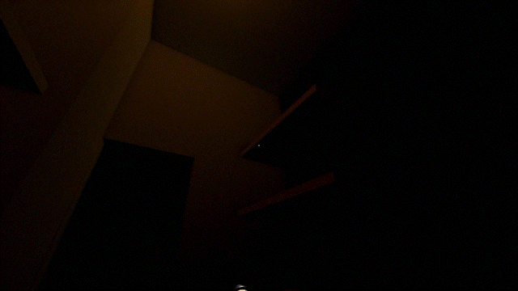

# Not YET Built
*Built September 2026*

A first-person horror game with light puzzles, focused on navigating the area by comparing what you see against what you hear. Be careful not to wander somewhere that doesn't exist YET.

## About
Built solo with [Godot 4.6.2](https://godotengine.org/) in 7 days for [Brackeys Game Jam 2026.2](https://itch.io/jam/brackeys-16), under the theme "Trust No One".

## How to Play
- Control
    - `WASD` to move
    - `Mouse` to look around
    - `Left Click` to interact
    - `Right Click` to ping
    - `F` to toggle flashlight
    - `E` to open map 
    - `Esc` to open settings
- Goal
    - Get out of this place

## Play It
- [Play the game now](https://okasn.itch.io/not-yet-built)
- [Jam submission page](https://itch.io/jam/brackeys-16/rate/4950751)